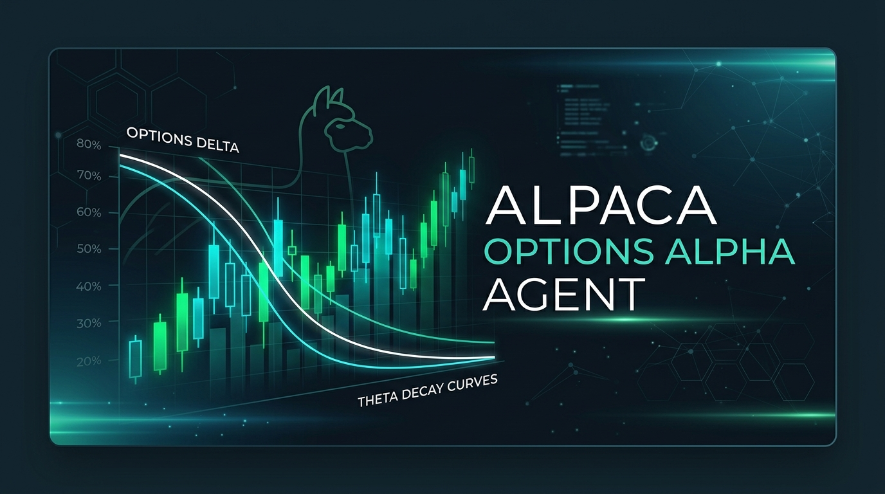
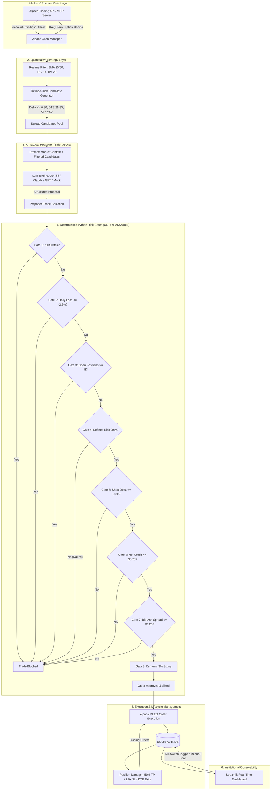

# Oxotradex: Autonomous Options Alpha Agent

[](https://opensource.org/licenses/MIT)
[](https://www.python.org/)
[](https://alpaca.markets/)
[](https://github.com/alpacahq/alpaca-mcp-server)
[](https://streamlit.io/)



> **Oxotradex is a production-ready, autonomous AI trading agent for the Alpaca AI Trading Agents Hackathon (lablab.ai × Alpaca).**  
> Systematically harvests option volatility risk premium ($\Theta$ decay) through high-probability, defined-risk credit spreads and Iron Condors on liquid index ETFs (`SPY`, `QQQ`, `IWM`), governed by an AI decision engine and 8 inviolable deterministic Python risk gates.

---

## Architecture Diagram



---

## Key Features & Quantitative Edge

1. **Systematic Theta Harvesting**: Underwrites defined-risk options credit spreads (Bull Put Spreads, Bear Call Spreads) and Iron Condors with 21–35 DTE, capturing accelerated time decay while isolating downside tail risk.
2. **Inviolable Deterministic Risk Gates**: AI suggests trades, but Python enforces the math. No LLM recommendation can ever bypass the 8 hard risk gates.
3. **Dual Alpaca MCP & alpaca-py SDK**: Natively compatible with the official `@alpacahq/alpaca-mcp-server` tool interface, backed by robust `alpaca-py` multi-leg (`OrderClass.MLEG`) order execution.
4. **Automated Lifecycle Management**: Automatically takes profits at **50% of maximum credit received**, caps losses at **2.0× credit**, and closes spreads when $\text{DTE} \le 1$ to prevent expiration pin risk.
5. **Circuit Breakers & Emergency Kill-Switch**: Hard circuit breaker trips at $-2.5\%$ daily loss ($\le -\$2,500$ on a $\$100\text{k}$ account). Global kill-switch stops trading instantly.
6. **Real-Time Streamlit Dashboard**: Live equity curves, active positions table with Greeks, circuit-breaker headroom meter, and an AI decision audit log.

---

## Deterministic Risk Gates (Code-Enforced Invariants)

| Gate | Name | Rule / Condition | Action on Breach |
| :--- | :--- | :--- | :--- |
| **Gate 1** | **Emergency Kill-Switch** | Global kill-switch engaged in DB/settings | **Blocks all order execution immediately** |
| **Gate 2** | **Daily Circuit Breaker** | Cumulative daily PnL $\le -2.5\%$ ($-\$2,500$ on $\$100\text{k}$) | **Halts all new entries for the day** |
| **Gate 3** | **Capacity Limit** | Active open positions count $\ge 5$ | **Rejects trade; skips new scan** |
| **Gate 4** | **Defined Risk Invariant** | Short legs must have matching long wings | **Strictly rejects naked/unhedged options** |
| **Gate 5** | **Delta Ceiling** | Short option delta $|\Delta| \le 0.30$ | **Rejects over-aggressive strikes** |
| **Gate 6** | **Minimum Net Credit** | Credit received $\ge \$0.20$ per share ($\$20/\text{contract}$) | **Rejects low-premium spreads** |
| **Gate 7** | **Liquidity Gate** | Bid-Ask spread $\le \$0.25$ and Open Interest $\ge 50$ | **Rejects illiquid option contracts** |
| **Gate 8** | **Capital Risk Sizing** | Total risk $\le 3.0\%$ of equity ($-\$3,000$ on $\$100\text{k}$) | **Dynamically sizes down contract quantity** |

---

## Launch in < 10 Minutes

### 1. Clone & Install Dependencies

```bash
git clone https://github.com/your-username/alpaca-options-alpha-agent.git
cd alpaca-options-alpha-agent

# Create and activate virtual environment
python -m venv venv
# On Windows:
.\venv\Scripts\activate
# On Linux/macOS:
source venv/bin/activate

# Install dependencies
pip install -r requirements.txt
```

### 2. Configure Environment

Copy `.env.example` to `.env`:

```bash
cp .env.example .env
```

Edit `.env` with your Alpaca Paper Trading API keys:

```env
ALPACA_API_KEY=PK********************
ALPACA_SECRET_KEY=****************************************
ALPACA_BASE_URL=https://paper-api.alpaca.markets
PAPER=True
DRY_RUN=False

# LLM Provider (options: gemini, openai, anthropic, or mock for offline zero-key testing)
LLM_PROVIDER=gemini
GEMINI_API_KEY=AIzaSy********************
LLM_MODEL=gemini-2.5-flash
```

*(Note: If no LLM key is supplied, the agent defaults to `mock` mode—an institutional quantitative selector that evaluates candidates deterministically!)*

### 3. Run Risk Gate Unit Tests

Verify that all 8 deterministic risk gates are fully functioning:

```bash
python -m pytest tests/test_risk.py -v
```

Output:
```text
tests/test_risk.py::test_valid_trade_passes_all_gates PASSED
tests/test_risk.py::test_gate1_kill_switch_blocks_trade PASSED
tests/test_risk.py::test_gate2_daily_circuit_breaker PASSED
tests/test_risk.py::test_gate3_max_concurrent_positions PASSED
tests/test_risk.py::test_gate4_naked_short_options_strictly_rejected PASSED
tests/test_risk.py::test_gate5_short_delta_cutoff PASSED
tests/test_risk.py::test_gate6_minimum_credit_rejection PASSED
tests/test_risk.py::test_gate7_liquidity_bid_ask_spread PASSED
tests/test_risk.py::test_gate8_position_sizing_enforces_3_percent_cap PASSED
============================== 9 passed in 0.17s ==============================
```

### 4. Run a Single Autonomous Scan Cycle (Dry-Run or Paper)

```bash
# Safe dry-run test:
python src/main.py --once --dry-run

# Live paper trading single cycle:
python src/main.py --once
```

### 5. Launch the Continuous Autonomous Loop

```bash
# Runs autonomous market scan every 15 minutes during market hours
python src/main.py --interval 15
```

### 6. Launch the Streamlit Real-Time Dashboard

In a separate terminal window:

```bash
streamlit run src/dashboard.py
```

Navigate to `http://localhost:8501` to view:
- Live Portfolio Equity & Today's P&L
- Distance to Daily Loss Circuit Breaker meter
- Open spread positions with Greeks and theta harvested %
- AI decision audit log with full LLM prompts and risk gate verdicts
- Interactive one-click Emergency Kill-Switch

---

## Alpaca MCP Server Integration

This agent supports the official **Alpaca Model Context Protocol (MCP) Server**:

```json
{
  "mcpServers": {
    "alpaca": {
      "command": "npx",
      "args": ["-y", "@alpacahq/alpaca-mcp-server"],
      "env": {
        "ALPACA_API_KEY": "YOUR_KEY",
        "ALPACA_SECRET_KEY": "YOUR_SECRET",
        "ALPACA_PAPER": "true"
      }
    }
  }
}
```

The agent dispatches standard MCP tools:
- `get_account`: Retrieves equity, cash, and daily PnL.
- `get_clock`: Queries market open/closed status and next session times.
- `place_option_order`: Atomically submits multi-leg option orders (`OrderClass.MLEG`).
- `close_spread`: Liquidates open multi-leg positions using reverse closing intents (`buy_to_close` / `sell_to_close`).

---

## Sample Decision Log

```text
┌──────────────────────────────────────────────┐
│ Oxotradex: Autonomous Options Alpha Agent    │
│ Paper Mode: True | Dry Run: False | LLM: gemini│
└──────────────────────────────────────────────┘
[*] [INFO] --- Starting Autonomous Scan Cycle at 2026-09-03 14:45:00 UTC ---
[*] [INFO] Account Status: Equity: $100,000.00 | Cash: $100,000.00 | Daily PnL: $+0.00 (+0.00%)
[*] [INFO] Market Regime (SPY): NEUTRAL (Range-Bound / Chop) | EMA20: 541.21 | EMA50: 540.76 | RSI: 50.53
[*] [INFO] Generated 6 high-probability candidate spread(s) across universe.
[*] [INFO] Querying LLM Layer via provider: 'GEMINI' (Model: gemini-2.5-flash)...
[*] [INFO] LLM Macro Analysis: SPY trading range-bound between $538-$544. Elevated IV relative to HV20. Optimal setup for theta decay.
[*] [INFO] LLM Risk Assessment: Defined-risk wings cap maximum portfolio risk. Delta buffered at 0.18.
[*] [INFO] Evaluating Risk Gates for candidate: SPY IRON_CONDOR
  PASSED | Gate 1: Kill-Switch: Kill-switch inactive.
  PASSED | Gate 2: Daily Circuit Breaker: Daily PnL is $0.00 (0.00%), within limit -$2500.00.
  PASSED | Gate 3: Max Concurrent Positions: Current positions: 0/5.
  PASSED | Gate 4: Defined Risk Check: Spread is fully defined risk with 4 hedged legs.
  PASSED | Gate 5: Short Delta Check: All short leg deltas are <= 0.30.
  PASSED | Gate 6: Minimum Credit Check: Net credit of $1.60 meets minimum requirement >= $0.20.
  PASSED | Gate 7: Liquidity Check: Liquidity validated (spreads <= $0.25, OI >= 50).
  PASSED | Gate 8: Position Sizing: Sized to 1 contract(s). Max risk: $340.00 <= $3000.00 (3.0% of $100000.00 equity).
[+] [SUCCESS] Trade successfully entered! DB ID: trade_e2d4646cdf | Alpaca ID: alpaca_mleg_0941341fa972
[+] [SUCCESS] --- Scan Cycle Completed. Executed 1 new trade(s). ---
```

---

## Directory Structure

```
alpaca-options-alpha-agent/
├── README.md                          # Complete project documentation & setup guide
├── requirements.txt                   # Production dependencies
├── .env.example                       # Environment variables template
├── pyproject.toml                     # Modern package metadata
├── src/
│   ├── main.py                        # Autonomous orchestrator loop
│   ├── config.py                      # Pydantic settings & validation
│   ├── alpaca_client.py               # Alpaca API & MCP multi-leg execution
│   ├── strategy.py                    # Regime detection & candidate spread generation
│   ├── llm_decision.py                # Structured LLM reasoning layer
│   ├── risk.py                        # 8 inviolable deterministic risk gates
│   ├── execution.py                   # Verified order placement & risk interception
│   ├── position_manager.py            # TP (50%), SL (2.0x), DTE lifecycle manager
│   ├── db.py                          # SQLite state persistence & audit logging
│   ├── logger.py                      # Rich console visualizer
│   └── dashboard.py                   # Streamlit real-time dashboard
├── prompts/
│   └── decision_prompt.txt            # Institutional derivatives prompt
├── tests/
│   └── test_risk.py                   # Unit tests for all 8 risk gates
├── docs/
│   ├── submission_dossier.md          # Master hackathon submission form dossier
│   ├── cover_image.jpg                # 16:9 Institutional presentation cover graphic
│   ├── one_page_writeup.md            # 1-page executive writeup for judges
│   ├── presentation_slides.md         # 10-slide comprehensive presentation deck
│   ├── video_script.md                # 3-minute video presentation script
│   └── social_posts.md                # 5 ready-to-publish posts for X & LinkedIn
└── scripts/
    ├── run_agent.bat                  # Windows launcher
    ├── run_agent.sh                   # Unix/macOS launcher
    └── reset_paper_account_notes.md   # Step-by-step $100k account reset guide
```

---

## License

This project is licensed under the **MIT License** — see the [LICENSE](LICENSE) file for details.
